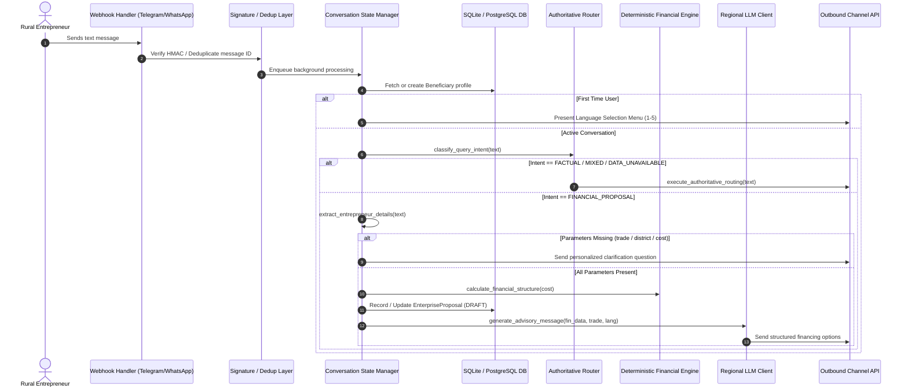

# Phase 7 End-to-End Runtime Architecture Map

This document establishes the verified architectural trace for all runtime flows in **Rural Enterprise Advisor**, detailing every processing stage from raw user input across channels to final response and DPR delivery.

---

## 1. Flow Inventory & Component Mapping

| Flow # | Flow Name | Channel Entry Point | Core Handler Module | Intent Classification | Authoritative Retrieval / Lookup | Financial Engine | LLM Role | Output Delivery |
|---|---|---|---|---|---|---|---|---|
| **1** | Telegram Text | `POST /webhook/telegram` or Long-Polling | `app/dialogue/conversation_state.py::process_telegram_query` | `classify_query_intent` | `retrieve_evidence` (if Factual/Mixed) or `get_trade_benchmark` (if Proposal) | `calculate_financial_structure` (if Proposal/Mixed/Fin) | Narrative synthesis only (Prompt Grounded) | `send_telegram_text` |
| **2** | Telegram Voice | `POST /webhook/telegram` (voice/audio) | `app/dialogue/conversation_state.py::process_telegram_voice_query` | `classify_query_intent` post-transcription | Same as Flow 1 | Same as Flow 1 | Same as Flow 1 | `send_telegram_text` + `send_telegram_voice` (TTS) |
| **3** | WhatsApp Text | `POST /webhook/whatsapp` | `app/dialogue/conversation_state.py::process_user_query` | `classify_query_intent` | Same as Flow 1 | Same as Flow 1 | Same as Flow 1 | `send_whatsapp_text` |
| **4** | WhatsApp Voice | `POST /webhook/whatsapp` (audio) | `app/dialogue/conversation_state.py::process_voice_query` | `classify_query_intent` post-transcription | Same as Flow 1 | Same as Flow 1 | Same as Flow 1 | `send_whatsapp_text` (+ voice if supported) |
| **5** | Factual Knowledge Query | Any Channel | `app/retrieval/router.py::execute_authoritative_routing` | `QueryIntent.FACTUAL` | `retrieve_evidence` (Qdrant top_k=3, `require_verified=True`) | None (Engine Bypassed) | Explains retrieved statutory evidence | Text with bracketed citations |
| **6** | Financial Proposal Progression | Any Channel | `app/dialogue/conversation_state.py::_handle_extraction_and_advisory` | Proposal Stage (`COLLECTING` / `ADVISING`) | `get_trade_benchmark` (`BenchmarkRepository`) | `calculate_financial_structure` + `project_financial_cashflows` | Generates empathetic regional advisory | Structured Advisory + Next Step Prompt |
| **7** | Mixed Query (Fact + Fin) | Any Channel | `app/retrieval/router.py::execute_authoritative_routing` | `QueryIntent.MIXED` | `retrieve_evidence` (Qdrant top_k=2) | `calculate_financial_structure` | Synthesizes fact + immutable financial result | Text with citation + exact EMI/Loan figures |
| **8** | DATA_NOT_AVAILABLE Query | Any Channel | `app/retrieval/router.py::execute_authoritative_routing` | `QueryIntent.DATA_UNAVAILABLE` | None (Directly blocked from synthetic hallucination) | None | Bypassed (Pre-formatted official notice) | Standardized official notice (`citations: []`) |
| **9** | Detailed Project Report (DPR) | Any Channel | `app/dialogue/conversation_state.py::_handle_dpr_generation` | Command (`GENERATE DPR`) | `analyze_benchmark_deviation` (`BenchmarkRepository`) | Full 5-Year Cashflow + DSCR Amortization | Bypassed entirely (ReportLab deterministic PDF) | PDF Document (`send_document`) + R2/Local Link |

---

## 2. Detailed Step-by-Step Flow Traces

### Flow 1 & 3: Inbound Text (Telegram & WhatsApp)

### Flow 2 & 4: Inbound Voice (Telegram & WhatsApp)
1. **Entry Point**: Telegram webhook receives `voice`/`audio` object; WhatsApp webhook receives `type: "audio"`.
2. **Audio Fetching**:
   - Telegram: `download_telegram_file(file_id)` downloads `.ogg`/`.oga` file.
   - WhatsApp: `download_whatsapp_media(media_id)` queries Graph API media endpoint.
3. **Speech-to-Text (STT)**:
   - `app/voice/voice_service.py::transcribe_audio(audio_bytes)` invokes Groq Whisper (`whisper-large-v3-turbo`) with fallback to Google Cloud STT.
   - Automatically detects spoken language or prompts language normalization.
4. **Dialogue Routing**: Transcribed text enters `_process_inbound_message(..., from_voice=True)`.
5. **Text-to-Speech (TTS)**:
   - For voice respondents, alongside text delivery, `_send_voice_audio_reply` calls `synthesize_speech(text, lang)` using Google Cloud TTS or local gTTS.
   - Audio is dispatched via `send_telegram_voice` / WhatsApp audio message.

### Flow 5: Factual Question Routing
1. **Classification**: `classify_query_intent` detects factual terms (`"unit cost"`, `"benchmark"`, `"pmegp"`, `"aidis"`, `"nabard"`).
2. **Retrieval**: `retrieve_evidence(query, top_k=3, require_verified=True)`:
   - Embeds query using local FastEmbed (`BAAI/bge-small-en-v1.5`, 384 dimensions).
   - Queries local Qdrant collection `authoritative_knowledge`.
   - Filters `verification_status == "VERIFIED_OFFICIAL"`.
3. **Context Construction**: `build_grounded_llm_messages`:
   - System prompt instructs model to act strictly as a factual narrator.
   - Mandates citing exact source title and page number.
   - Forbids extrapolating beyond retrieved excerpts.
4. **Synthesis**: `call_llm_chat` formats answer in requested regional language.
5. **Historical Governance**: If SAMADHAN Flour Mill is retrieved, an explicit 2020 price level warning is appended if not already present.

### Flow 6: Financial Proposal Progression
1. **Extraction**: `extract_entrepreneur_details(text)` parses trade, district, project cost, available capital.
2. **Validation**: `validate_project_cost(project_cost)` enforces [₹5,000, ₹50,00,000] boundaries.
3. **Calculation**: `calculate_financial_structure(cost)`:
   - Micro-Finance Scheme (MFS): Outlay ≤ ₹1,50,000, 10% margin, 90% loan (max ₹1.2L loan), 6.5% interest, 36 months tenure (3 months moratorium).
   - Term Loan Scheme (TLS): Outlay > ₹1,50,000, 15% margin, 85% loan (max ₹50L loan), 8.0% interest, 84 months tenure (6 months moratorium).
4. **Multi-Scheme Evaluation**: `get_all_eligible_schemes` calculates PMEGP subsidy (up to 35%) and Mudra alternatives.
5. **Cashflows & DSCR**: `project_financial_cashflows(cost, emi)` computes 5-year operating statement.
6. **Proposal Persistence**: Saved to DB with status `DRAFT`.
7. **Advisory Synthesis**: `generate_advisory_message` formats multi-scheme comparison in user's language.

### Flow 7: Mixed Query (Factual + Financial)
1. **Classification**: Query references both official benchmarks and personal financing (e.g., *"I want to start a dairy with 2 cows. What will it cost and what will my EMI be?"*).
2. **Dual-Track Execution**:
   - Track A: Authoritative retrieval retrieves NABARD 2-cow unit cost benchmark (₹2,29,000 / Page 41).
   - Track B: Deterministic engine calculates EMI for the benchmark or stated cost.
3. **Prompt Grounding**: The LLM receives the pre-calculated EMI and loan structure as immutable facts. The prompt explicitly forbids the LLM from recalculating math.
4. **Response**: Delivers both the citation and exact numerical results.

### Flow 8: DATA_NOT_AVAILABLE Query
1. **Classification**: Keywords identify Kirana, Tailoring, or PMMY borrower interest rates.
2. **Zero-Hallucination Isolation**:
   - The query does **NOT** hit Qdrant (preventing accidental nearest-neighbor matches).
   - The LLM is **NOT** invoked to guess or estimate costs.
3. **Deterministic Notice**: Pre-translated standard response returned explaining the official source gap.
4. **Citations**: Strictly empty (`citations: []`).

### Flow 9: Detailed Project Report (DPR) Generation
1. **Trigger**: User inputs `"GENERATE DPR"` or `"DPR"`.
2. **Data Assembly**: Loads verified proposal parameters, beneficiary profile, and trade benchmarks.
3. **Provenance & Deviation**: `analyze_benchmark_deviation` compares proposed cost against official benchmark (`BenchmarkRepository`).
4. **PDF Compilation**: `app/dpr/generator.py::generate_dpr_pdf`:
   - Builds 2-page institutional PDF via ReportLab.
   - Page 1: Header, Promoter Profile, Itemized Assets/Working Capital, Debt Servicing Norms.
   - Page 2: 5-Year Cash Flow Projections, Multi-Scheme Comparison, Provenance Table, Deviation Advisory.
   - Historical Flag: Displays 2020 warning for Flour Mill.
5. **Storage & Dispatch**: PDF bytes uploaded to storage; direct download URL and PDF document dispatched to user.

---

## 3. Invariant Verification Matrix

| Invariant | Enforced By | Failure Mode Prevented |
|---|---|---|
| **No LLM Financial Math** | `app/finance/calculator.py` | Hallucinated amortization, erroneous interest sums |
| **No Synthetic Fallback** | `BenchmarkRepository(real_data_only=True)` | Fabricated benchmark figures masquerading as official |
| **No Unrelated Substitution** | `classify_query_intent` (`QueryIntent.DATA_UNAVAILABLE`) | Substituting Flour Mill for Kirana via vector similarity |
| **Historical Price Governance**| `BenchmarkRepository` + `router.py` + `generator.py` | Presenting 2020 capital equipment prices as 2026 spot quotes |
| **Population vs Individual Separation** | `app/retrieval/ingest.py` + `router.py` | Using AIDIS macro statistics to score individual creditworthiness |
| **State Separation** | `conversation_context` in SQLite/Postgres DB | Factual questions corrupting active loan proposal state |
| **Channel Idempotency** | `crud.is_webhook_processed` | Duplicate DPR generation or re-processing on webhook retries |
